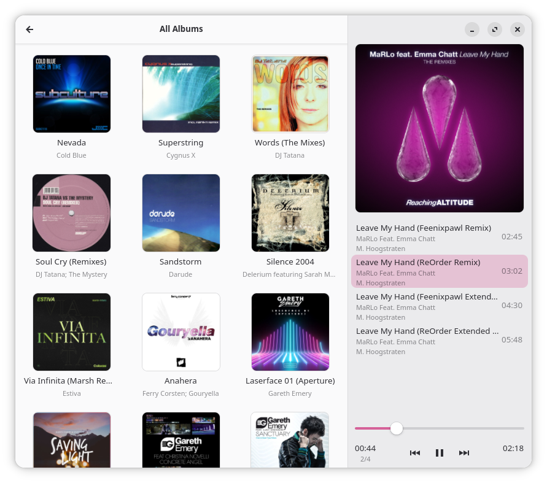

# Aria

A music library client that makes exploring and discovering your collection easy, with special support for classical music. It works with servers such as MPD or Lyrion, among others.

## Building

> This project is under heavy development and is not yet ready for use. It may not compile and could require unavailable
> dependencies.

1. Glone this repo recursive with `git clone --recurse-submodules`
2. Navigate to the cloned directory
2. Run the `./build.sh` script

# Dependencies
- [.NET 10](https://dotnet.microsoft.com/en-us/)

## Design Philosophy

This software aims to follow the [GNOME Human Interface Guidelines](https://developer.gnome.org/hig/).

## Contributing

Please try to follow the [GNOME Code of Conduct](https://conduct.gnome.org).

## Thanks

These projects inspired Aria:

 - [Cantata](https://github.com/CDrummond/cantata) (Craig Drummond)
 - [Euphonica](https://github.com/htkhiem/euphonica) (Huỳnh Thiện Khiêm)
 - [LMS-Material](https://github.com/CDrummond/lms-material)  (Craig Drummond)
 - [Plattenalbum](https://github.com/SoongNoonien/plattenalbum) (Martin Wagner)
 - [Stylophone](https://github.com/Difegue/Stylophone) (Difegue)

This project uses the following open source libraries:

 - [MpcNET](https://github.com/glucaci/MpcNET) (Gabriel Lucaci)
 - [Gir.Core](https://gircore.github.io/) (Marcel Tiede)